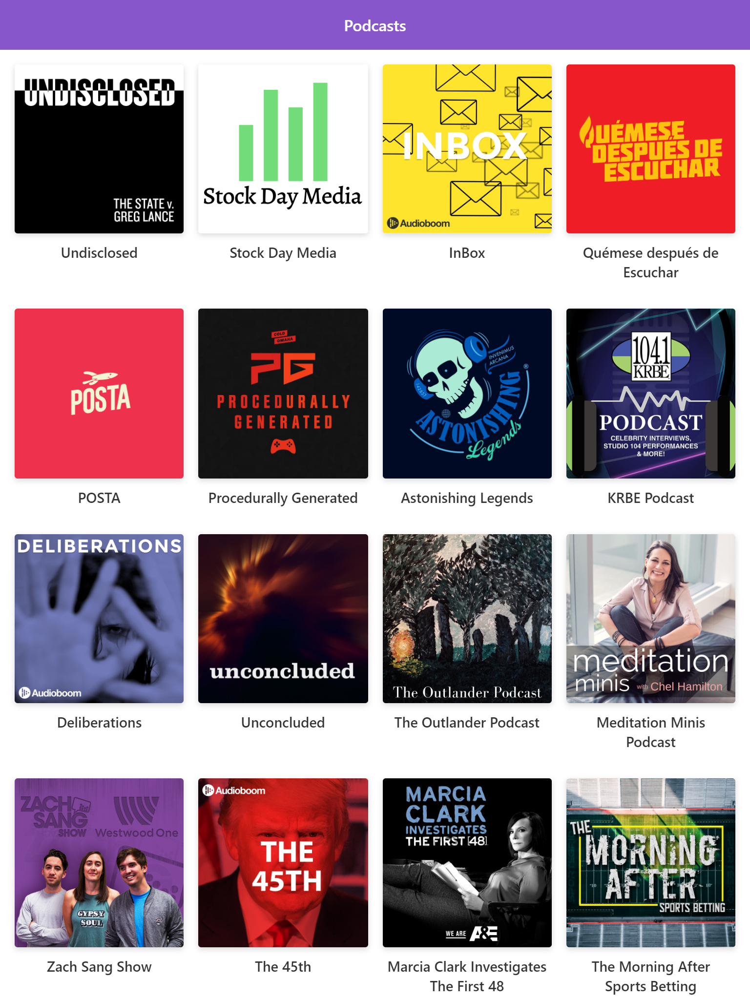

# App de Podcasts de Platzi

App de Podcasts integrada con la API de AudioBoom para aprender Next.js

## ¿Cómo funciona?

Requiere NodeJS LTS (12)

* `npm install` para instalar dependencias
* `npm run dev` para correr la aplicación en modo desarrollo
* `npm run start` para correr la aplicación en modo producción sin construir una build final
* `npm run build` para correr crear la build para producción

# Licencia

MIT